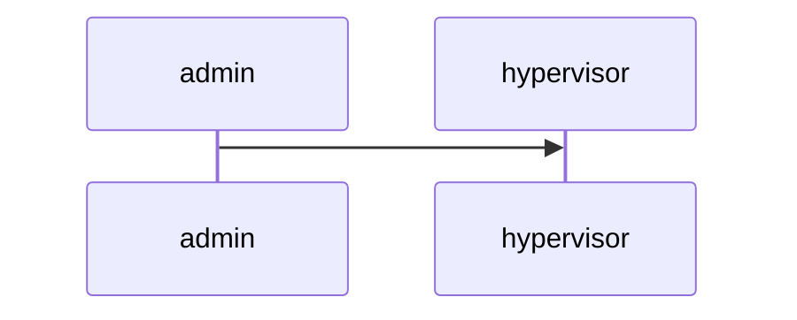

*Overview*
**Core idea:** 
Host runs a single hypervisor/container host. Each worker gets a VM or container stored on a separately encrypted on-disk dataset/volume that is only decrypted when the worker presents their USB token. Admins provision VMs and manage keys via an HSM/Vault. Worker access is via SSH or RDP using keys/certs stored on their USB token (YubiKey or smartcard PIV).

**Components:**
***Hypervisor / manager:***
Proxmox VE (KVM/QEMU + LXC) with ZFS datasets.
> NOTE: I'll use proxmox first then might try implementing my own hypervisor using libvirt

***Storage encryption per-VM:***
ZFS native dataset encryption (per dataset). ZFS can create encrypted datasets so each VM/container’s storage is separately encrypted and won’t be mounted until you load its key.

***USB token for unlocking:*** 
Implement custom keychain for unlocking vms/decrypting ZFS datasets and managing keys + custom usb key using microcontroller (I have esp32c3 so ill use it for now)

***User authentication to the VM:***
I'll start with SSH only, (and possibly RDP support if there’s enough time)

***Short-lived access & privileged operations:***
Implement support for issuing short-lived SSH certificates for administration purpose.

**Requirements:**
- Runs on a single server
- Admins create VMs
- Workers access only their container
- All containers encrypted with separate keys
- Workers connect via USB key

*Structure*

**Actors:**
- _User_: Ability to access their VM with USB key.
- _Admin_: Ability to create/delete VMs.
- _Superuser_: Ability to monitor proxmox, access to master server, access to master key for kering vault.

**Setup:**

**What I need to implement:**

proxmox pre create vm hook to create zfs volume and read key from keyring

keyring to create and manage keys; api for zfs creation hooks to get password

client program to read key from usb and connect to vm, also update clients key if keyring asks so

admin program (validate admins by their keys) to create users (using proxmox admin tool), create keys (using keyring), read other users keys (using keyring)

keyring generates new keys and pushes to usb, everytime the last password is used it pushes new key (so store current and last keys in db)

vm auto shutdown on no connections
