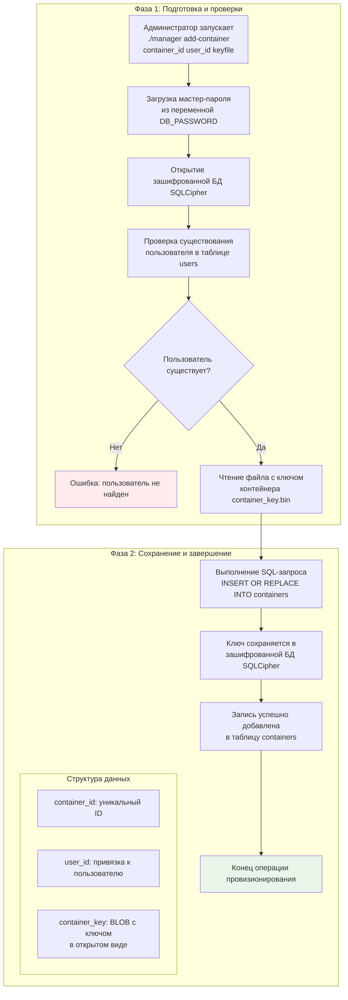
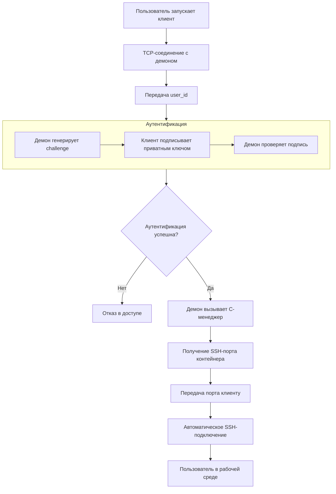
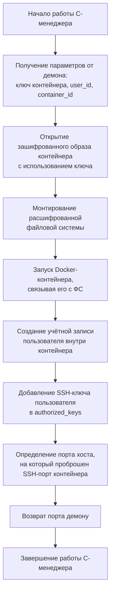

# Usage
## Build
**Manager:**
Build:
```sh
make manager
```
Usage:
```sh
make env
./manager
```
**Client:**
Build:
```sh
make client
```
Usage:
```sh
./client
```

# Overview

## Core idea: 
Host runs a single hypervisor/container host. Each worker gets a container stored in encrypted format that is only decrypted when the worker presents their USB token. Admins provision containers and manage keys via an Database. Worker access is via SSH or RDP using keys/certs stored on their USB token (YubiKey or smartcard PIV).


## Components:
### Hypervisor / manager:
Docker with per container encryption?
> NOTE: I'll use docker first then might try implementing my own hypervisor using libvirt?

### Unlocking:
Store keys in encrypted SQLite database. Password for decrypting database is stored as ENV variable on host.

### User authentication to the VM:
I'll start with SSH only, (and possibly RDP support if there’s enough time)

### Short-lived access & privileged operations:
Tokens with userid and privelege id are stored in SQLite databse. When user tries to log in database is decrypted and user token is compared to the one stored in database (by userid), if they match docker will be decrypted using password stored in database and new token will be generated and sent to user.

## Requirements:
- Runs on a single server
- Admins create containers
- Workers access only their container
- All containers encrypted with separate keys
- Workers connect via USB key

# Structure

## Actors:
- _User_: Ability to access their VM with USB key.
- _Admin_: Ability to create/delete VMs.
- _Superuser_: Ability to monitor containers, access to master server, access to master key for SQLite.

# Implementation

## USB key code:
 - detect USB
 - send hello
 - receive user_id
 - Kernel sends random challenge
 - USB device signs challenge with private key
 - Kernel verifies signature with stored public key

## Steps
 - [] write helper scripts for docker
 - [] write 'manager' code to communicate with client (TCP)
 - [] integrate 'manager' with sqlite
 - [] setup sqlite with encryption
 - [] write client code for communication
 - [] implement usb token



```mermaid
flowchart TD
    subgraph A [Фаза 1: Подготовка и проверки]
        A1[Администратор запускает<br>./manager add-container<br>container_id user_id keyfile]
        
        A1 --> A2[Загрузка мастер-пароля<br>из переменной DB_PASSWORD]
        A2 --> A3[Открытие зашифрованной БД SQLCipher]
        A3 --> A4[Проверка существования<br>пользователя в таблице users]
        
        A4 --> A5{Пользователь существует?}
        A5 -->|Нет| A6[Ошибка: пользователь не найден]
        A5 -->|Да| A7[Чтение файла с ключом<br>контейнера container_key.bin]
    end
    
    subgraph B [Фаза 2: Сохранение и завершение]
        B1[Выполнение SQL-запроса<br>INSERT OR REPLACE INTO containers]
        
        subgraph B1_Detail [Структура данных]
            B1a[container_id: уникальный ID]
            B1b[user_id: привязка к пользователю]
            B1c[container_key: BLOB с ключом<br>в открытом виде]
        end
        
        B1 --> B2[Ключ сохраняется в<br>зашифрованной БД SQLCipher]
        B2 --> B3[Запись успешно добавлена<br>в таблицу containers]
        B3 --> B4[Конец операции провизионирования]
    end
    
    A7 --> B1
    
    style A6 fill:#ffebee
    style B4 fill:#e8f5e8
```


```mermaid
flowchart TD
    A[Пользователь запускает клиент] --> B[TCP-соединение с демоном]
    B --> C[Передача user_id]
    C --> D[Challenge-Response аутентификация]
    
    subgraph D [Аутентификация]
        D1[Демон генерирует challenge] --> D2[Клиент подписывает приватным ключом]
        D2 --> D3[Демон проверяет подпись]
    end
    
    D --> E{Аутентификация успешна?}
    E -- Нет --> F[Отказ в доступе]
    E -- Да --> G[Демон вызывает C-менеджер]
    
    G --> H[Получение SSH-порта контейнера]
    H --> I[Передача порта клиенту]
    I --> J[Автоматическое SSH-подключение]
    J --> K[Пользователь в рабочей среде]
```


```mermaid
flowchart TD
    A[Начало работы C-менеджера]
    A --> B[Получение параметров от демона:<br>ключ контейнера, user_id, container_id]
    B --> C[Открытие зашифрованного образа контейнера<br>с использованием ключа]
    C --> D[Монтирование расшифрованной<br>файловой системы]
    D --> E[Запуск Docker-контейнера,<br>связывая его с ФС]
    E --> F[Создание учётной записи<br>пользователя внутри контейнера]
    F --> G[Добавление SSH-ключа пользователя<br>в authorized_keys]
    G --> H[Определение порта хоста,<br>на который проброшен SSH-порт контейнера]
    H --> I[Возврат порта демону]
    I --> Z[Завершение работы C-менеджера]
```


changelog:

**2026-02-14:**
- Implemented encrypted home directories using LUKS/dm-crypt
  - Created `volume.c/h` for managing encrypted volumes
  - Home directories are stored in `./homes/<container_id>.img` (100MB encrypted loopback files)
  - LUKS encryption with container key, decrypted on host and bind-mounted to container
  - Automatic cleanup when container stops (umount + cryptsetup close)
  - Background thread monitors containers every 10s (configurable), closes volumes for stopped containers
  
- Fixed SSH authentication for encrypted volumes
  - SSH keys now set up directly in the encrypted volume (host side) instead of container overlay
  - Added `docker_setup_ssh_in_volume()` to create `.ssh/authorized_keys` in the mounted volume
  - Added `docker_fix_ssh_permissions()` to run `chown` inside container for proper ownership
  - Keys persist across container restarts since they're in the encrypted volume
  
- Added automatic container lifecycle management
  - Manager waits for user to connect via SSH (up to 60s timeout)
  - Monitors SSH connections, detects when user disconnects
  - Automatically stops container and encrypts home when no active SSH connections
  - 30-minute timeout as fallback if connections don't close properly
  
- Added Makefile commands
  - `make clean-containers` - stops and removes all Docker containers
  - `make cleanup-luks` - closes stale LUKS devices and removes mount points
  - `make register-user USER=<name> CONTAINER=<id>` - registers user and creates container

- Added signal handling for graceful shutdown (SIGINT/SIGTERM)
  - Cleans up all mounted encrypted volumes on shutdown
  
- Root privileges required for LUKS operations
  - Manager must run with sudo for cryptsetup to work

